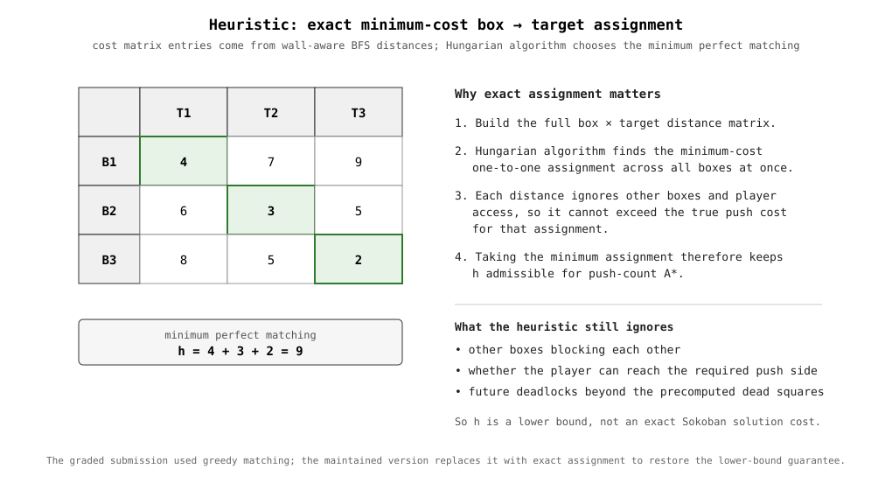
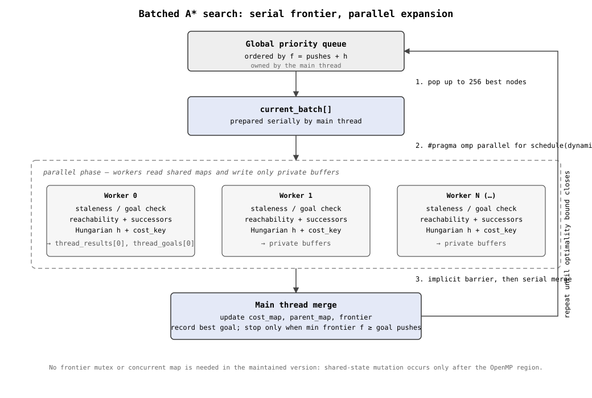

# Design Notes

## Background

[Sokoban](https://en.wikipedia.org/wiki/Sokoban) is a box-pushing puzzle: a
player pushes boxes (never pulls) around a grid until every box sits on a
target square. It's PSPACE-complete, and full boards blow up into a huge
state space, so the assignment is really a search-and-parallelism problem
wearing a puzzle-game costume.

The map format (`#` wall, `x`/`X` box off/on target, `o`/`O`/`!` player
off/on-target/on-`@`, `.` target, `@` a special floor tile) and the output
contract (a `WASD` move string) come from the course's reference tooling and
grading harness, which aren't part of this repo — only `src/solver.cpp` is
this project's own work. A minimal example map:

```text
#########
#  xox..#
#   #####
#########
```

The maintained branch keeps the original assignment's push-based search
objective: one box push costs 1, while the player's walking path used to
reach the pushing square is recorded only for reconstruction. Therefore
"optimal" below means **minimum number of box pushes**, not minimum length of
the returned `WASD` string.

## State representation

A search state is a single `std::string`: byte 0 is the player's linear
position (`row * width + col`), and the remaining bytes are sorted box
positions. Packing each square index into a single byte keeps states small
and hashing cheap, at the cost of capping supported maps to 256 cells.

Search deduplication intentionally uses a coarser key than the exact state.
For a fixed box layout, two player positions in the same connected reachable
region are equivalent for push search: the player can walk between them
without changing the push count. `get_cost_key()` therefore flood-fills the
player's reachable region and substitutes its lowest-numbered square as the
canonical player component of the key.

## Precompute phase

Before search starts, two board-dependent structures are built once:

- **Wall-aware distances.** A BFS from every target records the shortest
  wall-respecting grid distance from that target to every square. These
  distances ignore boxes and player access, so they are optimistic relative
  to the true number of pushes required.
- **Dead squares.** Reverse-push reachability is flood-filled from the target
  squares. If a box is pushed onto a square from which no target can be
  reached even in this optimistic reverse model, the successor is pruned.

## Heuristic: exact box→target assignment



The submitted solver used a greedy assignment: repeatedly choose the cheapest
remaining `(box, target)` pair. That prevents two boxes from claiming the
same target, but it is not guaranteed to find the minimum assignment cost.
Worse, a greedy matching can cost *more* than the true minimum assignment,
which means it is not necessarily an admissible A* heuristic.

The maintained version replaces that step with the Hungarian algorithm.
For each state it constructs the box×target cost matrix from
`true_distances[target][box]` and computes the exact minimum-cost perfect
matching.

Each matrix entry is still only a lower bound on the real pushes needed:
it accounts for static walls but ignores other boxes, player positioning,
and push-direction constraints. Minimizing the sum of those optimistic costs
therefore preserves the lower-bound property. The resulting `h` is
admissible for the solver's **push-count** objective.

This does not make the heuristic exact for Sokoban; it only makes the
assignment step exact. Box interactions can still make the real solution
cost much larger than `h`.

## Parallel search: batched master/worker A*



The expensive part of search is successor generation, not manipulating the
priority queue. The solver therefore keeps the frontier and global maps on
the main thread and parallelizes only expansion:

1. **Pull.** The main thread removes up to `BATCH_SIZE` (256) lowest-`f`
   nodes from the priority queue.
2. **Expand.** `#pragma omp parallel for schedule(dynamic)` distributes
   those nodes across workers. Each worker performs staleness checks,
   reachability BFS, successor generation, heuristic evaluation, and
   canonical-key construction, writing only to its own buffer.
3. **Merge.** After the OpenMP region ends, the main thread folds each private
   buffer into `cost_map`, `parent_map`, and the frontier.

Because no worker mutates the shared frontier or maps, the maintained version
no longer needs `frontier_mutex` or TBB's concurrent map. The OpenMP barrier
at the end of the parallel loop separates the worker phase from serial merge.

### Preserving minimum-push optimality

The submitted batched version stopped as soon as *any* worker found a goal in
the current batch. That is unsafe: another state in the same batch, or a
state still in the frontier, can have a smaller `f` and lead to a lower-push
goal.

The maintained version treats a discovered goal as an **incumbent** instead:

- workers report goal candidates together with their push counts;
- the main thread keeps the best goal found so far;
- search continues until the frontier is empty or its minimum
  `f = pushes + h` is at least the incumbent goal cost.

With the admissible assignment heuristic above, no remaining open state can
then lead to a solution with fewer pushes, so batching no longer sacrifices
minimum-push optimality.

This guarantee is deliberately about pushes. The walking path stored between
pushes is a BFS path chosen during successor generation, but walking moves do
not contribute to `g`, so the returned `WASD` sequence is not guaranteed to
have minimum total length among all minimum-push solutions.

### Parent-map correction

The submitted version used
`tbb::concurrent_unordered_map<State, pair<State,string>>::insert()` for
parent links. If a state was first discovered through a higher-cost route and
later accepted through a lower-cost route, `cost_map` changed but `insert()`
left the old parent untouched. Reconstruction could therefore follow a path
inconsistent with the current best cost.

The maintained version uses an ordinary `std::unordered_map` and assignment:

```cpp
parent_map[next_state] = {parent_state, move_str};
```

so every accepted cost improvement updates the corresponding reconstruction
edge as well.

## Getting the concurrency model right

The current implementation is the result of several iterations rather than
the original submission frozen in place:

1. **Per-node locking.** Every worker independently popped and pushed the
   shared priority queue. Contention dominated the useful work and the
   implementation was prone to deadlock.
2. **Batched expansion with a coarse dedup key.** Batching reduced lock
   pressure, but an early "zone" identifier could conflate player regions
   that were not equivalent under the current box layout.
3. **Exact reachability key.** A BFS-derived canonical square replaced the
   coarse zone identifier.
4. **Move expensive key computation into workers.** Reachability-key BFS was
   shifted out of serial merge and into the parallel expansion phase.
5. **Post-submission correctness pass.** The maintained version replaces the
   greedy heuristic with exact assignment, changes first-goal termination to
   incumbent-bound termination, fixes parent replacement on cost
   improvements, and removes synchronization infrastructure no longer needed
   by the batched architecture.

The Git history preserves the graded version; these later changes are
maintenance fixes rather than claims about what was originally submitted.

## Known limitations

- **256-cell map ceiling.** State positions occupy one byte, so maps larger
  than 256 cells cannot be represented safely.
- **Push-optimal, not move-optimal.** Search minimizes the number of box
  pushes, not total player movement in the emitted `WASD` string.
- **Heuristic ignores box interactions.** Exact assignment is admissible but
  can still be loose because the BFS distances treat boxes as absent and do
  not model the player's ability to get behind a box for each future push.
- **Fixed batch size.** `BATCH_SIZE = 256` is a throughput choice, not a
  dynamically tuned parameter. Different boards and core counts could favor
  a different batch size.
- **Course-format assumptions.** The parser assumes the assignment's
  wall-bounded, rectangular boards; it is not hardened as a general-purpose
  Sokoban file parser.

## OpenMP vs. pthreads

OpenMP fits the final architecture because the parallel work is a clean
fork-join phase: expand a collection of independent nodes, then return to a
single-threaded merge. `schedule(dynamic)` helps when successor-generation
cost varies across states. A manually managed pthread pool could avoid some
parallel-region overhead and expose more scheduling control, but it would
also reintroduce thread-lifecycle and work-queue machinery that this design
no longer needs.
